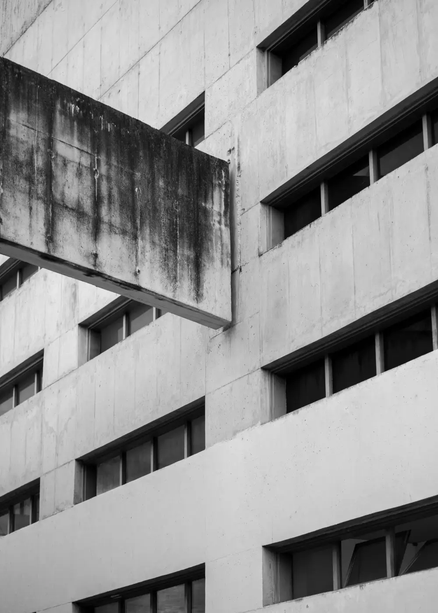

# PHOTOGRAPHE — ATELIER LUMEN

Un seul écran, **1440 × 900**, arrêté. Rien en dessous, aucun
défilement. Le nom reprend celui déjà porté par `DIRECTIONS.md § 11` —
atelier **fictif**, coordonnées neutres.

**La thèse en une ligne :** le noir n'est pas un fond, c'est le mur ;
la photographie est un tirage accroché dessus, et **elle est en train
de monter du bain** quand on entre.

---

## Les trois références

Six relevés lancés, cinq réussis (`holtermand.dk` refusé —
`ERR_CERT_COMMON_NAME_INVALID`). Trois retenus. Les deux écartés sont
dits à la fin.

### 1 · MEECH213 — `https://www.meech213.com`

Relevé : `tools/_refs/photo-meech/`. Awwwards Site of the Day,
29 juin 2026.

**Les chiffres du relevé.** Fond `rgb(245, 244, 241)` · **hauteur de
page 900 px** — l'accueil ne défile pas · 27 images dans le document,
**0 image de plus de 380 px** · h1 mesuré = le mot « Menu »,
`Ceraph Roman` **32 px / 32 px**, `rgb(0,0,0)` · corps `articulat-cf`
**16 px** · Lenis seul, ni GSAP, ni ScrollTrigger, ni CSS piloté au
défilement.

**Mesuré sur `0-heros.png`.** L'unique visuel du premier écran fait
**137 × 152 px**, posé en **x 1035–1172 · y 278–430** : **17 % de la
hauteur** de l'écran, dans le quart haut-droit, jamais au centre. Le
mot-symbole est en haut à gauche, **incliné**, ~11 px. Le menu est en
bas au centre : cinq mots en serif d'affichage ~30 px dont **un seul**
est noir, les quatre autres à ~8 % d'opacité, et un **trait de 1 px**
part d'un point pour relier le mot actif.

**Ce qu'elle prouve.** Le vide peut être le sujet. Une vignette de
137 px perdue dans 1 296 000 px² de crème tient un écran entier sans
jamais avoir l'air vide — parce que chaque élément restant est posé au
pixel, et qu'aucun ne se répète.

**Ce qu'on lui prend.** Le rapport d'échelle : une image *minuscule*,
décalée, hors centre. Le trait de 1 px, qui donne une direction au
vide au lieu de le décorer. Et l'accueil qui ne défile pas.

**Ce qu'on écarte.** Le crème (nous : `#000000`). Les cinq niveaux de
gris typographiques — nous n'en avons que **deux**. Le mot-symbole
incliné : aucun angle qui ne soit droit. Le menu en gros serif au
centre bas — notre titre reste petit et **notre centre reste vide**.

### 2 · JACK DAVISON — `https://www.jackdavison.co.uk/`

Relevé : `tools/_refs/photo-davison/`.

**Les chiffres du relevé.** Fond `rgb(255, 255, 255)` · h1
`Untitled Sans Medium` **16 px / 29,76 px**, chasse 0,3 px, couleur
`rgb(255,255,255)` — donc le nom du photographe est **écrit et
invisible** · corps `Untitled Sans` **14 px** · **hauteur de page
900 px** · **2 images** en tout, **1 seule** de plus de 380 px ·
**aucune bibliothèque** : ni GSAP, ni Lenis, ni Locomotive, ni
scroll-driven CSS.

**Mesuré sur `0-heros.png`.** La photographie occupe
**x 446–994 · y 99–795** = **548 × 696 px**, soit **77 % de la
hauteur** et 38 % de la largeur. Marges gauche et droite : **446 px
chacune** — strictement centrée. Un compteur « Recent — 1/32 » est
posé **au milieu de l'image**, en gris presque illisible. La nav tient
en deux mots au bas au centre : « Index — Thumbs », 14 px.

**Ce qu'elle prouve.** Un portfolio de ce rang peut n'être **qu'un
seul écran arrêté** — pas de défilement, pas de grille, pas de
section, pas une ligne de JavaScript d'animation. Le compteur suffit à
dire qu'il y a une suite.

**Ce qu'on lui prend.** L'écran unique (hauteur 900, rien en dessous).
Le refus de toute bibliothèque. Deux libellés de nav, pas huit. Et
l'idée qu'on peut ne rien expliquer.

**Ce qu'on écarte.** Le centrage parfait — le nôtre est décalé de
253 px à droite et 69 px vers le bas. L'échelle : 77 % de hauteur chez
lui, **42 % chez nous**. Le blanc. Et surtout **le texte posé sur
l'image**, qui nous est interdit.

### 3 · MARTON PERLAKI — `https://www.martonperlaki.com/`

Relevé : `tools/_refs/photo-perlaki/`.

**Les chiffres du relevé.** **Une seule famille** pour tout le site
(`unica`), et **une seule taille : 14 px / 16 px**. Le h1 mesuré n'est
pas un nom : c'est la **légende de l'œuvre affichée** — « Parklife
issue 3 », `rgb(0,0,0)`, 400. Fond transparent sur blanc · hauteur de
page **900 px** · 210 images chargées, **une seule montrée**.

**Mesuré sur `0-heros.png`.** Bandeau unique à **y = 20**, trois
groupes sur une seule ligne au même corps : nom à gauche (x 16),
**légende au centre** (x 641), nav à droite (finit à x 1425). L'œuvre
est posée sur une planche grise de **x 224–1216 · y 90–762** ; la
photographie elle-même fait **x 533–916 · y 163–681 = 383 × 518 px**.

**Ce qu'elle prouve.** Une seule taille de caractère peut tenir toute
une page si la hiérarchie se fait par la **position** et par le
**gris**, jamais par le corps. Et la légende a droit à la place du
titre.

**Ce qu'on lui prend.** La ligne de tête unique où le nom et la nav
cohabitent au même corps. La hiérarchie par le gris (`#8A8A8A`)
plutôt que par la taille. La légende traitée comme un contenu de
premier rang — chez nous, le **cartel**.

**Ce qu'on écarte.** La planche grise sous l'œuvre : c'est une
deuxième valeur de fond, et nous n'en avons qu'une. Le centrage. Et la
couleur qui monte de l'œuvre (un orange vif pleine page) — nos images
sont en noir et blanc, sans exception.

### Les deux relevés écartés, et pourquoi

- **`thomasprior.com`** (`tools/_refs/photo-prior/`) — une image
  centrée de **537 × 673 px** sur blanc, mot-symbole 19 px en haut à
  gauche. C'est Davison une deuxième fois : rien de plus à en tirer.
- **`satoshiwatanabe.org`** (`tools/_refs/photo-watanabe/`) — l'écran
  d'accueil est un **index de texte pur**, 40 lignes, aucune image,
  `Suisse Intl` 15 px. Extrême admirable, mais chaque ligne est un
  **nom de client réel** : le dispositif nous est interdit à la
  racine.

---

## La direction artistique

| Poste | Décision |
|---|---|
| **Référence culturelle** | Une salle d'exposition la lumière éteinte, et **la chambre noire** juste à côté. Le noir n'est pas un fond : c'est le mur, et c'est le bain. On entre pendant que le tirage monte |
| **Palette (hex nommés)** | **noir** `#000000` — le mur, seule valeur de fond, aucune autre · **blanc cassé** `#EDEAE4` — le titre, le mot-symbole, la première ligne du cartel, le filet du geste · **gris** `#8A8A8A` — le sous-titre, la nav au repos, les deux dernières lignes du cartel, les coordonnées. **Trois valeurs. Zéro accent, pas même une.** Contrastes sur noir : `#EDEAE4` ≈ **17,9 : 1**, `#8A8A8A` ≈ **6,1 : 1** — les deux passent AA en corps 10 px |
| **Typographie (familles + px + interlignage)** | **`instrument-serif` 400** — titre **44 px / 46,6 px** (interlignage **1,06**), ligne 1 romain, **ligne 2 italique**. C'est le seul gros caractère de l'écran, et il n'est pas gros. · **`inter` 400** — sous-titre **13 px / 19,5 px** ; nav et bouton **12 px**, capitales, interlettrage **0,1 em**. **`inter` 600** — mot-symbole seul, **12 px**, capitales, 0,1 em. · **`jetbrains-mono` 500** — cartel, coordonnées, mention de démonstration : **10 px / 16 px**, capitales, 0,08 em. · **Trois familles, cinq fichiers**, tous locaux : `instrument-serif-3` (romain), `instrument-serif-1` (italique), `inter-1`, `inter-3`, `jetbrains-mono-1`. Les deux faces serif sont **préchargées** — elles peignent le LCP |
| **Composition du premier écran (au pixel)** | **Grille de référence : 12 colonnes, marges extérieures 96 px, gouttières 24 px, colonne = 82 px.** La colonne 8 commence à **x = 838** ; c'est la seule ligne de force verticale de l'écran, et trois choses s'y accrochent. — **L'image : `images/secteurs-sites/photo-17.webp`**, source **1000 × 1400**, affichée **270 × 378 px** (échelle 0,27, **aucun recadrage** : le cadre du photographe n'est pas retaillé par le mur). Position : **bord gauche x = 838, bord haut y = 330** → bord droit 1108, bord bas 708. **Marges de l'image : gauche 838 · droite 332 · haut 330 · bas 192.** Hauteur = **42,0 % de l'écran** (plafond : 45 %). Centre de l'image (973, 519) contre centre géométrique (720, 450) : **décalée de 253 px à droite et 69 px vers le bas.** — **Le titre** : `instrument-serif` 44/46,6, deux lignes, bord gauche **x = 96**, **dernière ligne de base y = 708 — exactement le bord bas de l'image** (première ligne de base y = 661). Bloc ≈ 210 × 92 px, en bas à gauche. — **Sous-titre** : x = 96, largeur max **306 px**, première ligne de base **y = 740**. — **Cartel** : trois lignes mono, **alignées à droite sur x = 1108** (le bord droit de l'image), lignes de base **y = 740 · 756 · 772**. La première ligne du cartel et la première ligne du sous-titre partagent **y = 740** : c'est l'alignement caché qui traverse le vide. — **Ligne de tête**, ligne de base **y = 64** : mot-symbole à x = 96, nav à **x = 838**. **Le coin haut-droit reste vide, volontairement** — il conduit l'œil en bas à droite, sur le tirage. — **Bas de page** : bouton à x = 96, ligne de base **y = 838** ; coordonnées alignées à droite sur x = 1344, y = 838 ; mention de démonstration alignée à droite sur x = 1344, **y = 858**. — **Bilan du vide : surface encrée (boîtes englobantes comprises) ≈ 154 700 px² sur 1 296 000 = 11,9 %. Le noir occupe 88 %** (plancher exigé : 70 %) |
| **Formes** | **Angles vifs absolus.** `border-radius: 0` partout. Aucune ombre, aucun dégradé, aucun flou, aucun `backdrop-filter`, aucun cadre décoratif. **Le seul trait de l'écran est le filet de 1 px du geste** — et il bouge. Un tirage accroché n'a ni cadre ni passe-partout : il est punaisé au mur |
| **Traitement photo** | **Aucun.** Ni filtre, ni duotone, ni virage, ni recadrage, ni `object-position`. Le fichier est déjà en noir et blanc neutre — c'est la raison pour laquelle c'est lui. **`photo-16.webp` a été regardé en pleine résolution et refusé : il porte un net virage sépia**, et sur un écran qui s'interdit toute couleur d'accent, ce brun serait la seule couleur de la page. Ce qui a été vérifié sur `photo-17.webp` en taille réelle : aucune marque, aucune enseigne, aucun visage, aucune plaque, aucun numéro civique. **Pourquoi c'est elle qui doit porter tout le noir autour** : (a) ses deux tiers bas sont du béton clair — le tirage ne se dissout pas dans le mur, il y découpe un trou de lumière ; (b) ses fenêtres sont presque noires — le tirage **touche** le mur par ses points sombres, il n'est pas posé dessus, il en sort ; (c) le format **portrait** est le seul qui ne ressemble pas à un héros de site web : à 270 × 378 dans 1440 × 900, il se lit comme une épreuve, pas comme une bannière ; (d) le sujet — une dalle en porte-à-faux — est une **masse suspendue dans du vide**, ce que la page fait aussi |
| **Le geste et l'instant de capture** | **UN SEUL GESTE : LE BAIN.** Le tirage monte hors du noir, du **bas vers le haut**. Mécanique : `clip-path: inset(P% 0 0 0)` sur l'``, P de **100 → 0** ; un `` de **1 px**, `#EDEAE4`, large de **366 px** (l'image **plus 48 px de chaque côté**, donc x 790 → 1156) suit l'arête en `translateY`, et **tombe à `opacity: 0` sur les 8 derniers pour cent** de la course. **Durée 1400 ms**, `cubic-bezier(.22, 1, .36, 1)`, départ **+260 ms** après le chargement. Le sens n'est pas décoratif : c'est celui dans lequel on relève une épreuve du bain — et **aucun des onze autres écrans ne monte**. Aucun autre mouvement. Micro-interactions : nav et bouton passent de `#8A8A8A` à `#EDEAE4` en 180 ms, rien d'autre. Repos : image entière, filet invisible. `prefers-reduced-motion` et `@supports not` → **état FINAL** immédiat, aucune information perdue. — **L'INSTANT DE CAPTURE.** Cible : **62 % de la course visuelle**. Avec cette courbe, 62 % de progression tombe à **t = 17,6 %**, soit **246 ms après le départ = 506 ms après le chargement**. On ne se fie pas à l'horloge : la capture pose `class="instant"` sur `<html>`, qui applique `animation-delay: -246ms` **et** `animation-play-state: paused !important` — le `!important` est obligatoire, `animation` est un raccourci qui remet `running` (piège 16). **Le critère de recette se mesure au pixel, pas au chronomètre : sur la capture, l'arête blanche doit être à `y = 474 ± 6 px`**, les 143 px hauts du tirage encore noirs, les 235 px bas peints. À cet instant la dalle en porte-à-faux — le sujet — est **encore sous le noir** : on voit une façade coupée net, et on comprend qu'il en reste. Pour une preuve en séquence : cinq crans à 0/25/50/75/100 % de course, l'arête à **y = 330 · 424 · 519 · 613 · 708**, soit **~94 px d'image de plus à chaque image** — aucune planche plate possible |
| **Ce qu'on ne fait pas** | Aucune image plein cadre. Aucune grille, aucune mosaïque, aucune vignette, aucune planche-contact. Aucun titre géant — 44 px est un plafond, pas un point de départ. **Aucun texte posé sur l'image** (c'est ce qu'on refuse à Davison). Aucune couleur, aucune teinte, aucun accent — et donc **jamais le minium `#e2401f`, jamais le ciment, jamais la typographie d'APED**. Aucun rayon, aucune ombre, aucun dégradé, aucun flou, aucun cadre, aucun passe-partout, aucune bordure autour du tirage. Aucun défilement, aucune section sous la ligne de flottaison, aucune flèche « défiler ». Aucun curseur personnalisé, aucune lightbox, aucun compteur d'œuvres (il promettrait dix images qui n'existent pas sur cet écran). Aucun nom de client, aucune publication, aucun prix, aucun avis, aucune note. Aucune donnée de prise de vue inventée : le cartel ne dit que ce que l'image montre. Aucune requête tierce |

**Technique, pour que rien ne se perde à la construction.**
`` — dimensions réelles du fichier dans les attributs,
`270 × 378` en CSS, `fetchpriority="high"` : **CLS = 0**. Le fichier
fait 3,7 × la taille affichée, donc net sur un écran double densité.
Les cinq `.woff2` viennent de `../../fonts/demos/`, les deux faces
serif en `<link rel="preload">`. `<meta name="robots"
content="noindex,nofollow">`. Zéro requête tierce, zéro erreur
console, zéro bibliothèque — le geste est **une `@keyframes` CSS**, pas
GSAP.

---

## Le contenu exact

**Nom fictif :** Atelier Lumen — Québec.

| Emplacement | Texte, prêt à coller |
|---|---|
| `<title>` | `Atelier Lumen — photographie d'architecture, d'intérieur et d'objet` |
| `<meta name="description">` | `Atelier Lumen, photographe à Québec. Architecture, intérieur et objet. Une image montrée à la fois, en noir et blanc, sans retouche. Site de démonstration.` |
| Mot-symbole (haut gauche) | `ATELIER LUMEN` |
| Nav (à x = 838), trois libellés | `ŒUVRES` · `SÉRIES` · `L'ATELIER` — `ŒUVRES` est l'état courant, en `#EDEAE4` ; les deux autres en `#8A8A8A` |
| Titre `<h1>`, ligne 1 (romain) | `Une image` |
| Titre `<h1>`, ligne 2 (**italique**) | `à la fois.` |
| Sous-titre | `Photographie d'architecture, d'intérieur et d'objet. Québec.` |
| Cartel, ligne 1 (`#EDEAE4`) | `Nº 01 — DALLE EN PORTE-À-FAUX` |
| Cartel, ligne 2 (`#8A8A8A`) | `BÉTON, BANDEAUX DE FENÊTRES` |
| Cartel, ligne 3 (`#8A8A8A`) | `NOIR ET BLANC, SANS RETOUCHE` |
| Bouton (bas gauche) | `DEMANDER UNE SÉANCE` — filet de 1 px `#EDEAE4` à 10 px sous la ligne de base, exactement la largeur du libellé |
| Coordonnées (bas droite) | `000 000-0000 — COURRIEL@EXEMPLE.CA — ADRESSE SUR DEMANDE` |
| Mention obligatoire (bas droite, sous les coordonnées) | `SITE DE DÉMONSTRATION` |
| `alt` de l'image | `Une dalle de béton en porte-à-faux sort d'une façade percée de bandeaux de fenêtres. Noir et blanc.` |

**Pourquoi ce titre passe les quatre questions.** *Vrai* : l'écran
montre une image, une seule. *Vérifiable* : le visiteur n'a qu'à
regarder — la phrase et la page disent la même chose, et c'est le seul
titre de la fournée qui se prouve tout seul. *Contrôlé* : c'est notre
accrochage, pas un classement chez quelqu'un d'autre. *Compris en
trois secondes* par un patron de garage : « ce gars-là montre une
photo à la fois ». Aucun mot de métier, aucun chiffre à défendre.

---

## Ce qui me distingue des onze autres

**Composition.** Je suis le seul dont l'image ne remplit rien : une
seule photographie, **270 × 378 px**, soit **42 % de la hauteur** et
**7,9 % de la surface**, posée hors centre — les onze autres ouvrent
sur du plein cadre, des bandeaux, des grilles ou des aplats, et
aucun ne laisse **88 % de son premier écran** absolument vide.

**Couleur.** Je suis le seul des douze à n'avoir **aucun accent** —
`#000000`, `#EDEAE4`, `#8A8A8A`, trois valeurs et pas une teinte ;
là où les onze autres se reconnaissent à leur braise, leur acide,
leur or ou leur cyan, on me reconnaît à ce que je n'ai pas.

**Typographie.** Mon affichage est `instrument-serif` à **44 px** —
le plus petit titre de héros de la fournée, quand la barre commune est
de 90 à 160 px ; l'écart d'échelle ne se joue pas entre un titre géant
et un corps minuscule, il se joue entre **44 px et 10 px**, et la
seconde ligne du titre bascule en italique parce que c'est le seul
changement de voix que je m'autorise.
